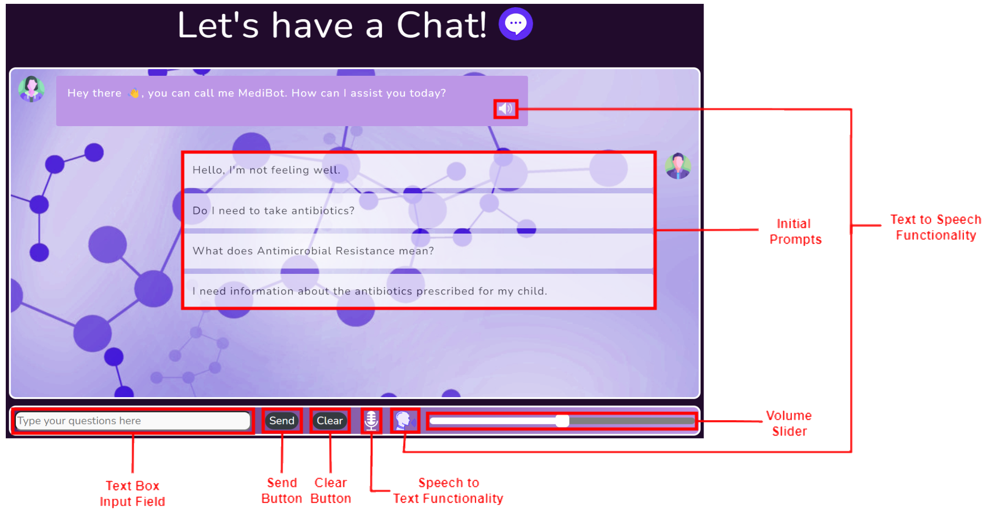
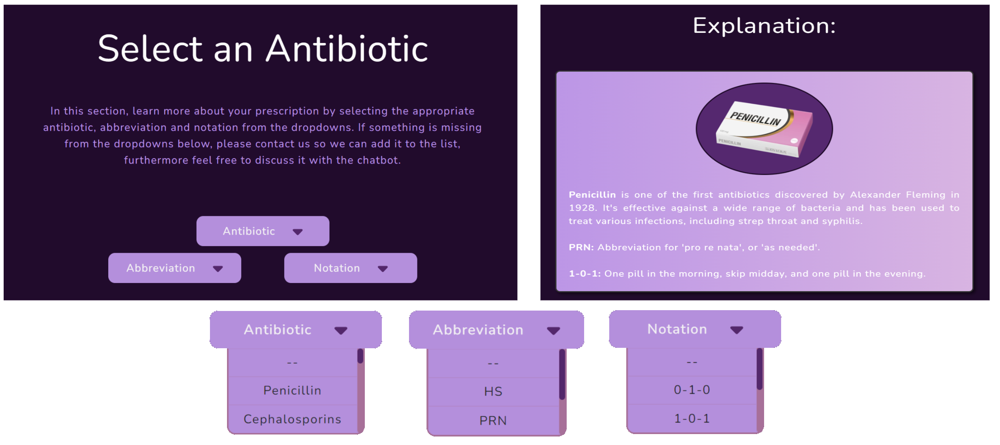
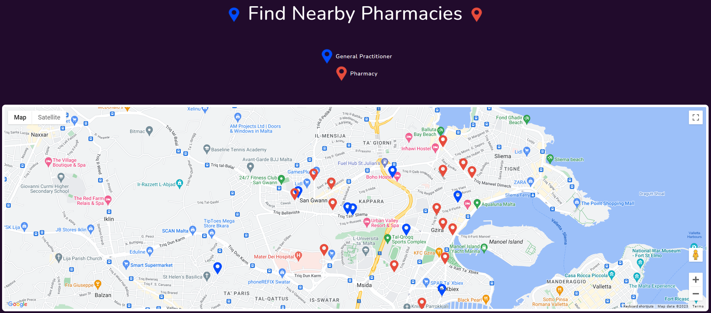
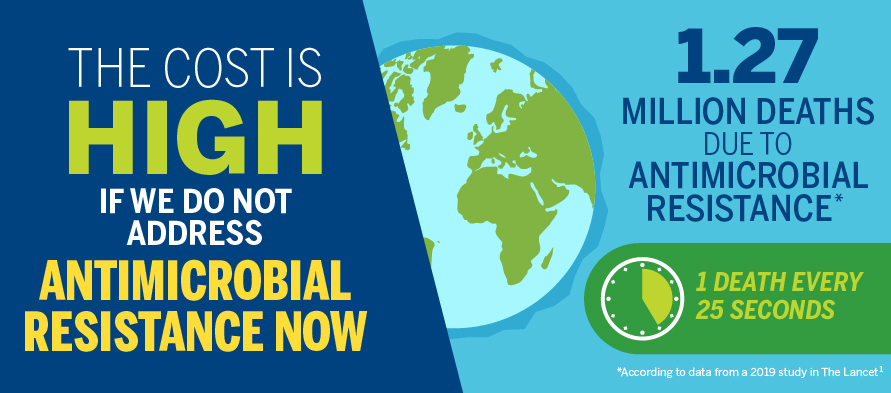
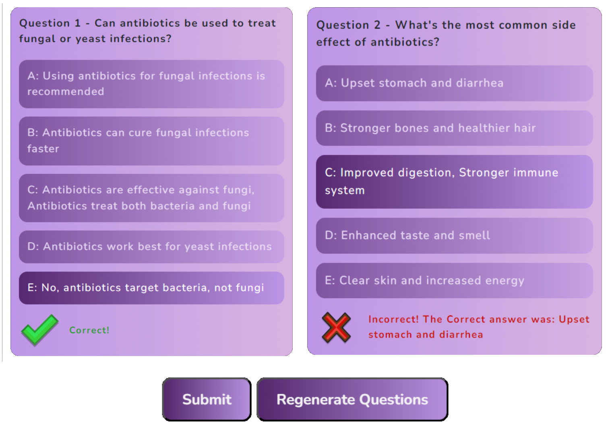
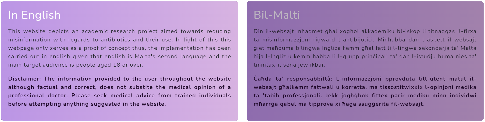
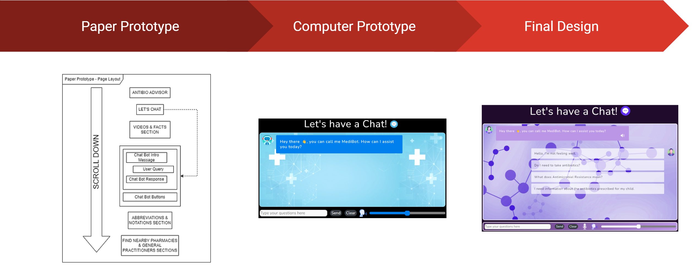

# AntiBio-Advisor
An intelligent interface project targeted towards educating people of different ages about when and why to use antibiotic medication.

This will be done by educating users through the use of a simple to use chat-bot which will answer varied questions relating to antibiotics and its use.


https://github.com/mbar0075/AntiBio-Advisor/assets/103250564/2c108b3f-d468-40dc-aa58-7efefce3ce30


## Table of Contents
- [AntiBio-Advisor](#antibio-advisor)
  - [Table of Contents](#table-of-contents)
  - [Motivation](#motivation)
  - [Proposed Solution](#proposed-solution)
  - [Chatbot](#chatbot)
  - [FAQ](#faq)
  - [Prescription Info](#prescription-info)
  - [Map](#map)
  - [Learn More](#learn-more)
  - [Quiz](#quiz)
  - [Ethical Considerations](#ethical-considerations)
  - [Mobile Functionality](#mobile-functionality)
  - [Interactable Design](#interactable-design)
  - [A Good Design takes a lot of Effort, Feedback and Time](#a-good-design-takes-a-lot-of-effort-feedback-and-time)
  - [Libraries used](#libraries-used)
  - [License](#license)

## Motivation
Antibiotic overuse breeds treatment resistance. This is a global problem that is rapidly increasing and threatens our ability to treat common infectious diseases. 

According to the **World Health Organisation**: "**Antimicrobials** - including antibiotics, antivirals, antifungals and antiparasitics - are medicines used to prevent and treat infections in humans, animals and plants."
Excessive antibiotic use leads to heightened drug resistance, impacting treatment efficacy and complicating infection management, posing severe health risks.

**Antimicrobial Resistance (AMR)** generates drug-resistant organisms globally, limiting treatment options, inflating healthcare costs, and elevating risks during medical procedures, necessitating urgent prevention and treatment strategies.

## Proposed Solution
**Antibio Advisor**, a web app tailored for individuals 18 or older but available for all. Our web app offers an array of vital features: an intelligent chatbot for medical guidance, an interactive map to locate pharmacies and general practitioners, and a comprehensive term guide. 

Prioritising user awareness, our platform provides essential information in the form of a FAQs page, an informative Quiz and a prescription info page.

The web app features mentioned above needed to be implemented in such a manner that they are easily accessible and usable. This was facilitated through a variety of different features such as:

* **Web Page Demo** which guides the user on proper usage of applicable web pages.
* **Dynamic page** size applicable for use with computers, mobile devices and tablets.
* **Colourful** and **simple** interface to ensure easy navigation.
* **Elderly individuals** were also considered through the use of a large font to ensure ease of use.


## Chatbot
<center></center>

As outlined above the chatbot has a myriad of different features ranging from:
* Set of **initial prompts** aimed at providing the user with a possible conversation starter.
* **Clear button** allowing the user to clear the current conversation and start afresh.
* **Speech to text** button allowing to use voice to communicate with the chatbot directly.
* **Text to Speech** button and volume slider allowing users to have messages read out loud.

These features and the general chatbot layout was selected whilst keeping the possible users in mind to ensure a pleasant user experience. Additionally the UIs adaptability to different screen sizes maintains the ease of use of the chatbot and its features.

## FAQ
The FAQ page is composed of a variety of relevant questions sorted according to relevant age groups these being General, Adult, Child, Elderly. This is done as certain knowledge is more applicable to certain age demographics. Additionally the FAQ can be sorted in accordance with the symptoms these being General, Cough, Rash, Skin Condition.

<center></center>

Further adding to the intractability of the webpage each question only displays the answer when selected by the user. This can be seen in the image showcased in this slide.

## Prescription Info
The main components of the Prescription Info page showcased here consist of three dropdowns relating to the **antibiotic name**, **abbreviations** and **notations** used by doctors when prescribing medicine. 

These dropdowns when appropriately selected provide the user with explanations regarding their antibiotics and the relevant dosages as denoted by a medical professionals prescription notation. 
The dropdowns in addition to a sample explanation can be seen in the current slide.


<center></center>

## Map
The map was designed to showcase the users nearest pharmacies and general practitioners, this was carried out to provide the user with all the required information they might require to purchase, enquire or return unused antibiotics. In the map the blue markers represent general practitioners and the red markers represent pharmacies.

<center></center>

## Learn More
The Learn More page similar to the FAQ page provides the user with a further degree of general information on the topic of AMR in contrast to the specific information presented in the FAQ page.

<center></center>

This page contains an informative video alongside an interactive carousel composed of several infographics and informative paragraphs. This can be seen in the current slide.


## Quiz

The webapp also includes a quiz  web page which compiles four questions from a possible set. This provides users a fun and engaging manner by which they can test their knowledge on AMR. Upon submitting the quiz users are provided with the correct answer where applicable in addition to a score showcased in the coming slide.   Furthermore the quiz can be regenerated multiple times and additional question can easily be added through the editing of a simple .json file.

<center></center>


## Ethical Considerations
The website is not intended to replace medical advice, and the chatbot is not a substitute for a doctor. The chatbot is intended to provide general information and guidance on antibiotics and their use. Additionally, a **disclaimer** is provided on the chatbot page to ensure that users are aware of the chatbot's limitations.

Moreover, **no user data is stored or kept**, ensuring that no chatbot history or personal information is stored on the platform or any cloud storage system. 

<center></center>


## Mobile Functionality
The web app is designed to be used on a variety of different devices ranging from mobile phones to tablets and computers. This is achieved through the use of a dynamic page size which adapts to the screen size of the device being used. This ensures that the web app is usable on a variety of different devices and maintains the ease of use of the web app.


<center></center>

## Interactable Design
The web app offers feedback to the user in the form of different bot expressions. This is achieved through the use of different images which are displayed depending on the current state of the demo bot.

<table>
  <tr>
    <td align="center">
      
    </td>
    <td align="center">
      
    </td>
  </tr>
</table>


## A Good Design takes a lot of Effort, Feedback and Time

The design of the web app was a long and arduous process which required a lot of effort and feedback. The design process was broken down into 3 main stages:
1. **Paper Prototyping** - This stage involved the creation of a paper prototype which was used to gather feedback from potential users. This feedback was then used to improve the design of the web app.
2. **Computer Prototyping** - This stage involved the creation of a computer prototype which was used to gather feedback in the form of recommendations and improvements. This feedback was then used to improve the design of the web app. Additionally, in this stage improvements from the previous stage were implemented into the design.
3. **Final Design** - This stage involved the creation of the final design which utilised the feedback gathered from the previous stages to create a final design which was then implemented into the web app.
   
<center></center>

## Libraries used
The following libraries were used in the development of the web app:

- [Bootstrap template](https://startbootstrap.com/theme/grayscale#google_vignette)
- [OpenAI API](https://beta.openai.com/)
- [Google API](https://developers.google.com/maps/documentation/javascript/overview)
- [Python Flask for hosting](https://flask.palletsprojects.com/en/2.0.x/)

## License

```latex
Copyright © Antibio Advisor 2023
Created by: Matthias Bartolo, Jerome Agius and Isaac Muscat
This project was developed under supervision of Dr Vanessa Camilleri and Mr Gavin Schranz at the University of Malta.
```
<center></center>

<!-- # Note

If streamlit_app.py is not used .devcontainor & .streamlit can be safely removed alongside streamlit_app.py . -->
